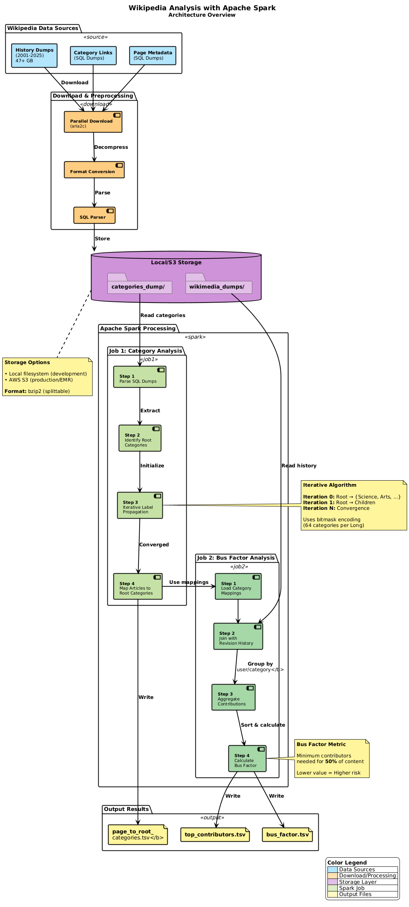

# Wikipedia Analysis with Apache Spark

A distributed data analysis project that processes Wikipedia's entire revision history and category structure to compute topic classifications and bus factor metrics using Apache Spark RDD API.

[](https://www.scala-lang.org/)
[](https://spark.apache.org/)
[](LICENSE)

## 📋 Table of Contents

- [Overview](#-overview)
- [Features](#-features)
- [Architecture](#-architecture)
- [Prerequisites](#-prerequisites)
- [Installation](#-installation)
- [Dataset Setup](#-dataset-setup)
- [Configuration](#-configuration)
- [Running Locally](#-running-locally)
- [Running on AWS EMR](#-running-on-aws-emr)
- [Understanding the Output](#-understanding-the-output)
- [Project Structure](#-project-structure)
- [Performance Analysis](#-performance-analysis)
- [Troubleshooting](#-troubleshooting)
- [License](#-license)

---

## 🎯 Overview

This project performs large-scale analysis on Wikipedia data (Up to 100+ GB compressed) to:

1. **Category Classification**: Maps Wikipedia articles to root topic categories using an iterative label propagation algorithm
2. **Bus Factor Analysis**: Calculates the "bus factor" for each topic category (minimum contributors needed for 50% of content)

The implementation demonstrates advanced Spark optimization techniques including broadcast joins, strategic persistence, and efficient aggregation patterns, achieving **X% performance improvement** over baseline implementations.

### Key Metrics
- **Used Dataset Size**: 37,5 GB compressed
- **Processing Time**: ~X minutes (optimized) vs ~X minutes (baseline)
- **Shuffle Reduction**: X% less data shuffled

---

## ✨ Features

- **Two Implementation Versions**:
  - Baseline (non-optimized) for performance comparison
  - Optimized version with advanced Spark techniques
  
- **Advanced Optimizations**:
  - Broadcast joins to eliminate massive shuffles
  - ReduceByKey instead of GroupByKey for 50% shuffle reduction
  - Strategic RDD caching and unpersistence
  - Partition coalescing after filters
  - LZ4 compression for shuffle optimization

- **Scalable Data Pipeline**:
  - Custom SQL dump parser for custom Wikipedia dataset size
  - Parallel download scripts with aria2c support
  - Splittable compression (bzip2) for distributed processing
  - Checkpoint-based lineage truncation for iterative algorithms

- **Comprehensive Analysis**:
  - Hierarchical category propagation with bitmask encoding
  - Top-N contributors tracking with PriorityQueue
  - 2 output generation (bus factor + top contributors)

---

## 🏗️ Architecture



### Algorithm: Iterative Label Propagation

The category classification uses an iterative algorithm that propagates category labels through Wikipedia's hierarchy:

```
Iteration 0: [Root] → {Science, Arts, ...}
Iteration 1: [Root] → [Children] → {Physics, Biology, ...}
Iteration 2: [Root] → [Children] → [Grandchildren] → {...}
...
Convergence: All reachable nodes labeled
```

Uses bitmask encoding for efficient storage (64 categories in a single Long).

---

## 🔧 Prerequisites

### System Requirements
- **OS**: Linux/macOS/Windows 11
- **RAM**: 8 GB minimum (16+ GB recommended)
- **Disk**: 150+ GB free space for full datasets
- **Java**: JDK 8 or 11
- **Scala**: 2.12.x
- **Spark**: 3.5.0 or later

### Development Tools
- **sbt** 1.9.0+
- **IntelliJ IDEA** (recommended) or any Scala IDE
- **Git**

### Optional Tools
- **aria2c**: For faster parallel downloads
- **AWS CLI**: For S3 operations and EMR management

---

## 📦 Installation

### 1. Clone the Repository

```bash
git clone https://github.com/yourusername/wikipedia-spark-analysis.git
cd wikipedia-spark-analysis
```

### 2. Install Java and Scala

#### On Ubuntu/Debian:
```bash
sudo apt update
sudo apt install openjdk-11-jdk scala
```

#### On macOS:
```bash
brew install openjdk@11 scala sbt
```

#### Verify Installation:
```bash
java -version    # Should show Java 11
scala -version   # Should show Scala 2.12+
sbt --version    # Should show sbt 1.9+
```

### 3. Install Apache Spark (Local Development)

```bash
# Download Spark
cd ~
wget https://archive.apache.org/dist/spark/spark-3.5.0/spark-3.5.0-bin-hadoop3.tgz
tar -xzf spark-3.5.0-bin-hadoop3.tgz
sudo mv spark-3.5.0-bin-hadoop3 /opt/spark

# Add to PATH
echo 'export SPARK_HOME=/opt/spark' >> ~/.bashrc
echo 'export PATH=$PATH:$SPARK_HOME/bin' >> ~/.bashrc
source ~/.bashrc

# Verify
spark-submit --version
```

### 4. Install Optional Tools

#### aria2c (for faster downloads):
```bash
# Ubuntu/Debian
sudo apt install aria2

# macOS
brew install aria2
```

#### AWS CLI (for EMR deployment):
```bash
# Ubuntu/Debian
sudo apt install awscli

# macOS
brew install awscli

# Verify
aws --version
```

### 5. Build the Project

```bash
cd wikipedia-spark-analysis
sh scripts/setup.sh
sbt assembly
```

This creates: `target/scala-2.12/wikipedia-analysis_2.12-1.0.jar`

---

## 📊 Dataset Setup

### Automatic Download (Recommended)

The project includes scripts to download Wikipedia dumps automatically.

#### Download Revision History (~500 MB for monthly dump):
```bash
# Download history for 2024 (adjust date range as needed)
./scripts/download_wiki_history.sh -s 2024-01 -e 2024-12

# Options:
#   -v VERSION     Dump version (default: 2025-11)
#   -w WIKI        Wiki name (default: enwiki)
#   -d DIR         Download directory (default: dataset/wikimedia_dumps)
#   -s START_DATE  Start date YYYY-MM (default: 2001-01)
#   -e END_DATE    End date YYYY-MM
#   -n             Dry run (generate URLs only)
```

**Download time**: faster with aria2c (parallel), x3-4 time slower with curl (sequential)

#### Download Category Structure (~5 GB):
```bash
# Download latest category dumps
./scripts/download_categories.sh

# Options:
#   -w, --wiki WIKI         Wikipedia language code (default: enwiki)
#   -d, --date DATE         Dump date YYYYMMDD (default: 20251201)
#   -D, --dir DIRECTORY     Download directory (default: ./dataset/sql_dumps)
#   -n, --dry-run           Show what would happen
```

### Manual Download

If scripts fail, download manually from:
- History: https://dumps.wikimedia.org/other/mediawiki_history/
- Categories: https://dumps.wikimedia.org/enwiki/

Place files in:
```
dataset/
├── wikimedia_dumps/           # History dumps (*.tsv.bz2)
└── categories_dump/           # Category dumps (*.sql.bz2)
    ├── enwiki-YYYYMMDD-categorylinks.sql.bz2
    ├── enwiki-YYYYMMDD-linktarget.sql.bz2
    └── enwiki-YYYYMMDD-page.sql.bz2
```

---

## ⚙️ Configuration

### 1. AWS Credentials Setup

Is recommended to follow the setup.sh script, but here are the steps for a manual configuratio

#### For AWS CLI (S3 and EMR operations):

Create `aws/` directory structure:
```bash
mkdir -p aws
```

**File 1: `aws/credentials`**
```ini
[default]
aws_access_key_id = YOUR_ACCESS_KEY_ID
aws_secret_access_key = YOUR_SECRET_ACCESS_KEY
```

**File 2: `aws/config`**
```ini
[default]
region = us-east-1
output = json
```

#### For Spark Application (S3A access):

Create credentials file in project:
```bash
mkdir -p src/main/resources
```

**File: `src/main/resources/aws_credentials`**
```
YOUR_ACCESS_KEY_ID
YOUR_SECRET_ACCESS_KEY
```

### 2. Project Configuration

Edit `src/main/scala/utils/Config.scala`:

```scala
object Config {
  // S3 bucket name (create via AWS Console first)
  val s3BucketName = "your-bucket-name-here"
  
  // Local project directory (absolute path)
  val projectDir = "/home/youruser/wikipedia-spark-analysis"
  
  // S3 paths (relative to bucket root)
  val s3DatasetPath = "datasets/"
  val s3OutputPath  = "output/"
  val s3HistoryPath = "spark-logs/"
  
  // Credentials file location (relative to resources/)
  val credentialsPath: String = "/aws_credentials"
}
```

### 3. Create S3 Bucket

```bash
# Create bucket
aws s3 mb s3://your-bucket-name-here --region us-east-1

# Upload datasets
aws s3 sync dataset/wikimedia_dumps/ s3://your-bucket-name-here/datasets/wikimedia_dumps/
aws s3 sync dataset/categories_dump/ s3://your-bucket-name-here/datasets/categories_dump/
```

---

## 🚀 Running Locally

### Quick Start (Sample Data)

```bash
# Build
sbt assembly

# Run optimized version on sample data
spark-submit \
  --class JobLauncher \
  --master local[*] \
  --driver-memory 4g \
  --executor-memory 4g \
  target/scala-2.12/wikipedia-analysis_2.12-1.0.jar \
  local [cat|bus] overwrite optimized
  
```

### Run Specific Jobs

```bash
# Category analysis only
spark-submit --class JobLauncher ... local cat overwrite optimized

# Bus factor analysis only
spark-submit --class JobLauncher ... local bus overwrite optimized

```

### Command Line Arguments

```bash
JobLauncher <deployment-mode> <job-type> <write-rule> <version>
```

| Argument | Options | Description |
|----------|---------|-------------|
| `deployment-mode` | `local`, `remote` | Where to run (local Spark vs AWS EMR) |
| `job-type` | `cat`, `bus`, `all` | Which analysis to run |
| `write-rule` | `overwrite`, `skip` | Overwrite existing outputs or skip |
| `version` | `baseline`, `optimized` | Which implementation to run |

### Monitor Execution

```bash
# Spark UI (while running)
open http://localhost:4040

```

### Output Locations

Results are saved to:
- **Optimized**: `output/`
- **Baseline**: `output_baseline/`

Files:
```
output/
├── page_to_root_categories/    # Article → Category mappings
├── root_category_indices.tsv   # Category index
├── bus_factor.tsv              # Bus factor per category
└── top_contributors.tsv        # Top contributors per category
```

---

## ☁️ Running on AWS EMR

### 1. Create EMR Cluster

#### Via AWS Console:
1. Go to EMR → Clusters → Create cluster
2. Choose:
   - **Release**: emr-7.0.0 (Spark 3.5.0)
   - **Applications**: Spark, Hadoop
   - **Instance type**: m4.xlarge or larger
   - **Number of instances**: 1 master + n core
   - **EC2 key pair**: Select your SSH key

3. Under "Security configuration":
   - Enable "Cluster visible on the internet"
   - Configure security groups for SSH access

#### Via AWS CLI:
```bash
aws emr create-cluster \
  --name "Wikipedia-Spark-Analysis" \
  --release-label emr-7.0.0 \
  --applications Name=Spark Name=Hadoop \
  --ec2-attributes KeyName=your-key-pair,SubnetId=subnet-xxxxx \
  --instance-type m4.xlarge \
  --instance-count 5 \
  --use-default-roles \
  --log-uri s3://your-bucket-name-here/spark-logs/ \
  --region us-east-1
```

**Wait 10-15 minutes for cluster to start.**

### 2. Upload JAR to S3

```bash
sbt package
aws s3 cp target/scala-2.12/wikipedia-analysis_2.12-1.0.jar \
    s3://your-bucket-name-here/jars/
```
### 3. Submit Job via IntellijIDEA (Recommended)
Define a new Run/Debug Configuration with the following settings:
- Configuration type: Spark Submit - Cluster
- Name: Spark Cluster
- Region: us-east-1
- Remote Target: Add EMR connection
- Authentication type: Profile from credentials file
- Select "Set custom config" and give the paths to the "config" and "credential" files
- Click on "Test connection" to verify
- Enter a new SSH Configuration
- Host: the address of the primary node of the cluster, i.e., the MasterPublicDnsName (see [AWS CLI cheatsheet]())
- Username: hadoop
- Authentication type: Key pair
- Private key file: point to your .ppk
- Test the connection
- Application: point to the .jar file   inside   the build/libs folder of this   repository; if   you don't find it, build the   project
- Class: JobLauncher
- Run arguments: Select your desired configuration, e.g.:`remote all overwrite optimized`
- Before launch: Upload Files Through SFTP
- Hit the Run button and wait for the application to finish (you should see "final status: SUCCEEDED" in the last Application report).
- Check out the results in the "output" folder in your S3 bucket (via CLI or GUI).7

### 4. Submit via SSH (Alternative)

```bash
# SSH to master node
ssh -i your-key.pem hadoop@<master-public-dns>

# Copy JAR from S3
aws s3 cp s3://your-bucket-name-here/jars/wikipedia-analysis_2.12-1.0.jar ./

# Submit job
spark-submit \
  --class JobLauncher \
  --master yarn \
  --deploy-mode cluster \
  --driver-memory 4g \
  --executor-memory 8g \
  --executor-cores 2 \
  --num-executors 4 \
  wikipedia-analysis_2.12-1.0.jar \
  remote all overwrite optimized
```

### 5. Monitor Job Execution

#### Spark UI (Active Jobs):
```bash
# SSH tunnel
ssh -i your-key.pem -L 8088:localhost:8088 hadoop@<master-public-dns>

# Open browser
open http://localhost:8088/cluster
```

#### Spark History Server (Completed Jobs):
```bash
# SSH tunnel
ssh -i your-key.pem -L 18080:localhost:18080 hadoop@<master-public-dns>

# Open browser
open http://localhost:18080
```

#### View Logs:
```bash
# Via SSH
ssh -i your-key.pem hadoop@<master-public-dns>
yarn logs -applicationId application_XXXXXXXXXXXXX_XXXX

# Or download from S3
aws s3 sync s3://your-bucket-name-here/spark-logs/ ./logs/
```

### 6. Download Results

```bash
# Download outputs
aws s3 sync s3://your-bucket-name-here/output/ ./output_aws/

# View results
cat output_aws/bus_factor.tsv
cat output_aws/top_contributors.tsv
```

### 7. Terminate Cluster

```bash
aws emr terminate-clusters --cluster-ids j-XXXXXXXXXXXXX
```

---

## 📊 Understanding the Output

### Category Analysis Output

**root_category_indices.tsv**
```
12345   Science     0
67890   Arts        1
11111   Technology  2
```
Format: `PageID \t CategoryName \t BitIndex`

**page_to_root_categories/part-*****
```
987654  7    # Page 987654 belongs to categories at bit positions 0,1,2 (bitmask: 111 = 7)
123456  5    # Page 123456 belongs to categories at bit positions 0,2 (bitmask: 101 = 5)
```
Format: `PageID \t BitMask`

Decode bitmask:
```scala
val mask = 7  // Binary: 0111
// Bit 0 set: Science
// Bit 1 set: Arts  
// Bit 2 set: Technology
// Result: Page belongs to Science, Arts, Technology
```

### Bus Factor Output

**bus_factor.tsv**
```
Science     142     450000000
Arts        89      120000000
Technology  203     780000000
```
Format: `Category \t BusFactor \t TotalBytes`

Interpretation:
- **Science**: Minimum 142 contributors needed for 50% of content
- **Arts**: Minimum 89 contributors needed for 50% of content
- Lower bus factor = more concentrated contributions = higher risk

**top_contributors.tsv**
```
Science     Alice       12000000
Science     Bob         8500000
Arts        Charlie     4300000
```
Format: `Category \t Username \t BytesContributed`

---
## 📁 Project Structure

```
wikipedia-spark-analysis/
├── src/main/scala/
│   ├── JobLauncher.scala                          # Entry point - routes to jobs
│   ├── wikipediaCategoryAnalysis.scala            # Optimized category analysis
│   ├── wikipediaCategoryAnalysis_baseline.scala   # Baseline (non-optimized)
│   ├── wikipediaBusFactorAnalysis.scala           # Optimized bus factor
│   ├── NonOptimized_wikipediaBusFactorAnalysis.scala  # Baseline bus factor
│   ├── mediaWikiHistorySchema.scala               # Schema definitions
│   └── utils/
│       ├── Commons.scala                          # Common utilities
│       └── Config.scala                           # Configuration
│
├── src/main/resources/
│   └── aws_credentials                            # AWS keys (DO NOT COMMIT)
│
├── scripts/
│   ├── download_wiki_history.sh                   # Download revision history
│   ├── download_categories.sh                     # Download category dumps
│   └── split_stream.py                            # SQL dump line splitter
│
├── dataset/                                        # Local datasets (gitignored)
│   ├── wikimedia_dumps/                           # Revision history
│   ├── categories_dump/                           # Category structure
│   └── sample/                                    # 10MB sample for testing
│
├── output/                                         # Optimized job outputs
├── output_baseline/                                # Baseline job outputs
├── checkpoints/                                    # Spark checkpoints
│
├── docs/
│   ├── PERFORMANCE_ANALYSIS.md                    # Performance report template
│   ├── METRICS_COLLECTION_GUIDE.md                # How to collect metrics
│   └── OPTIMIZATION_DIFFERENCES.md                # Optimization details
│
├── build.sbt                                       # SBT build configuration
├── .gitignore                                      # Git ignore rules
└── README.md                                       # This file
```

---

## 📈 Performance Analysis

### Running Both Versions for Comparison

```bash
# Run baseline
spark-submit --class JobLauncher ... remote cat overwrite baseline
spark-submit --class JobLauncher ... remote bus overwrite baseline


# Run optimized
spark-submit --class JobLauncher ... remote cat overwrite optimized
spark-submit --class JobLauncher ... remote bus overwrite optimized

```

---

## 🐛 Troubleshooting

### Dataset Download Issues

**Problem**: `aria2c` not found
```bash
# Solution: Install aria2c
sudo apt install aria2  # Ubuntu
brew install aria2      # macOS
```

**Problem**: Download stuck or slow
```bash
# Solution: Resume download
# The script uses --continue=true, so just re-run:
./scripts/download_wiki_history.sh -s 2024-01 -e 2024-01
```

**Problem**: Wikimedia dump date doesn't exist
```bash
# Solution: Check available dates
curl -s https://dumps.wikimedia.org/enwiki/ | grep -o 'href="[0-9]*/"' | grep -o '[0-9]*'

# Use an available date
./scripts/download_categories.sh -d 20241101
```

### AWS/S3 Issues

**Problem**: `AWS credentials not found`
```bash
# Solution: Verify credentials setup
cat ~/.aws/credentials  # Should show your keys
aws s3 ls              # Should list buckets

# Re-configure if needed
aws configure
```

**Problem**: `Access Denied` when accessing S3
```bash
# Solution: Check IAM permissions
# Your IAM user needs:
# - s3:GetObject
# - s3:PutObject
# - s3:ListBucket
# On your bucket

# Verify bucket exists
aws s3 ls s3://your-bucket-name-here/
```

**Problem**: Spark can't read from S3
```bash
# Solution: Verify aws_credentials file
cat src/main/resources/aws_credentials
# Should show:
# Line 1: access_key_id
# Line 2: secret_access_key

# Rebuild
sbt clean package
```

### Spark Execution Issues

**Problem**: `Job failed - executor lost`
```bash
# Solution: Increase executor memory
spark-submit --executor-memory 12g ...

# Or reduce partition count
--conf spark.default.parallelism=100
```

**Problem**: `OutOfMemoryError: GC overhead limit exceeded`
```bash
# Solution: Tune GC settings
--conf spark.executor.extraJavaOptions="-XX:+UseG1GC -XX:InitiatingHeapOccupancyPercent=35"
```

**Problem**: Slow shuffle performance
```bash
# Solution: Enable compression
--conf spark.shuffle.compress=true \
--conf spark.io.compression.codec=lz4
```

**Problem**: `Class not found: JobLauncher`
```bash
# Solution: Verify JAR packaging
jar tf target/scala-2.12/wikipedia-analysis_2.12-1.0.jar | grep JobLauncher

# Should show: JobLauncher.class
# If missing, rebuild:
sbt clean package
```

### EMR Cluster Issues

**Problem**: Can't SSH to master node
```bash
# Solution 1: Check security group
# EMR master security group must allow:
# - Port 22 (SSH) from your IP

# Solution 2: Verify key permissions
chmod 400 your-key.pem

# Solution 3: Check cluster state
aws emr describe-cluster --cluster-id j-XXXXX | grep State
# Should be "WAITING" or "RUNNING"
```

**Problem**: Spark UI not accessible
```bash
# Solution: Use SSH tunnel
ssh -i your-key.pem -L 8088:localhost:8088 -L 18080:localhost:18080 hadoop@<master-dns>

# Then access:
# http://localhost:8088  (YARN)
# http://localhost:18080 (Spark History)
```

**Problem**: Job submitted but not running
```bash
# Solution: Check YARN logs
ssh -i your-key.pem hadoop@<master-dns>
yarn application -list
yarn logs -applicationId application_XXXXX
```

### Build Issues

**Problem**: `sbt: command not found`
```bash
# Solution: Install SBT
echo "deb https://repo.scala-sbt.org/scalasbt/debian all main" | sudo tee /etc/apt/sources.list.d/sbt.list
curl -sL "https://keyserver.ubuntu.com/pks/lookup?op=get&search=0x2EE0EA64E40A89B84B2DF73499E82A75642AC823" | sudo apt-key add
sudo apt update
sudo apt install sbt
```

**Problem**: `java.lang.OutOfMemoryError` during build
```bash
# Solution: Increase SBT memory
export SBT_OPTS="-Xmx4G -XX:+UseConcMarkSweepGC"
sbt clean package
```

**Problem**: Dependency resolution timeout
```bash
# Solution: Retry or use different resolver
sbt clean update
# If still fails, check your internet connection
```

### Data Processing Issues

**Problem**: "Checkpoint directory does not exist"
```bash
# Solution: Create checkpoint directory
mkdir -p checkpoints/

# On S3:
aws s3 mb s3://your-bucket/checkpoints/
```

**Problem**: Results are empty
```bash
# Solution: Check input data paths in Config.scala
# Verify files exist:
ls -lh dataset/wikimedia_dumps/
ls -lh dataset/categories_dump/

# Check logs for parsing errors
grep -i "error\|exception" /tmp/spark-*.log
```

**Problem**: Different results between baseline and optimized
```bash
# This should NOT happen!
# Solution: Verify correctness
diff output/bus_factor.tsv output_baseline/bus_factor.tsv

# If different, there's a bug - please open an issue!
```
#### Common Development Issues

**OutOfMemoryError**:
```bash
# Increase driver/executor memory
spark-submit --driver-memory 8g --executor-memory 8g ...
```

**Shuffle Fetch Failed**:
```bash
# Increase shuffle partitions
--conf spark.sql.shuffle.partitions=400
```

**Task Not Serializable**:
```scala
// Make sure all closures only use serializable objects
// Move non-serializable variables outside map/filter functions
```
---

## 📄 License

This project is licensed under the MIT License - see the [LICENSE](LICENSE) file for details.

---

**Last Updated**: February 2025  
**Version**: 1.0.0
